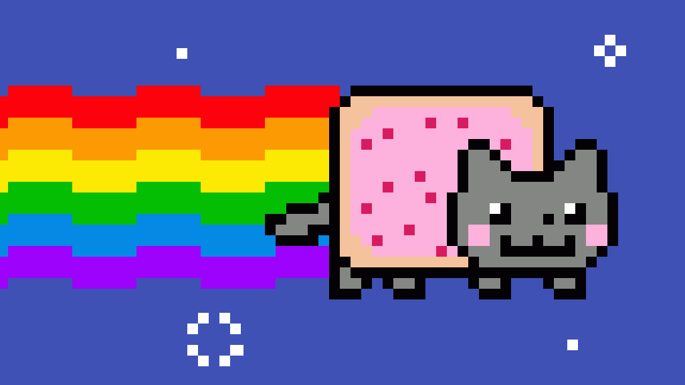

🌈 Nyan Cat GIF Generator 💖
Welcome to the cutest corner of GitHub! This simple and fun project uses a Python script to create an animated GIF of the legendary Nyan Cat.

✨ About This Project
This project takes a series of Nyan Cat images and stitches them together into a looping animation. It's a perfect beginner-friendly example of how to perform image manipulation in Python using the fantastic imageio library.

The script, animal.py, reads the following image files in order:

nyan-cat1.png

nyan-cat2.png

nyan-cat3.png

It then combines them into a single animal.gif file that loops forever!

🚀 Getting Started
Want to run this on your own machine? Just follow these simple steps!

Prerequisites
Make sure you have Python and pip installed on your system.

Installation & Usage
Clone this repository to your local machine:
git clone https://github.com/your-username/your-repository-name.git
cd your-repository-name
Install the necessary Python libraries:
This project requires imageio and Pillow. Install them using pip:

Bash

pip install imageio Pillow
Run the Python script:

Bash

python animal.py
Voila! ✨ Check the folder for your newly created animal.gif file. Open it in a browser to see the magic!

🎨 Customize It!
Want to make a GIF with your own images? It's super easy!

Add your images (e.g., frame1.jpg, frame2.jpg) to the project folder.

Open the animal.py file and change the filenames in the list:

Python

# lib/animal.py

# Change these to your image filenames
filenames = ['frame1.jpg', 'frame2.jpg', 'frame3.jpg', 'frame4.jpg']
You can also change the speed of the animation by modifying the duration value. The value is in milliseconds (e.g., duration = 100 for a very fast GIF).

Python

# lib/animal.py

# Change duration to 100ms per frame
iio.imwrite('animal.gif', images, duration = 100, loop = 0)
Run the script again (python animal.py) and enjoy your custom GIF!

Made with ❤️ and a sprinkle of rainbow magic.
CREDITS:CODEX PlATFORM

